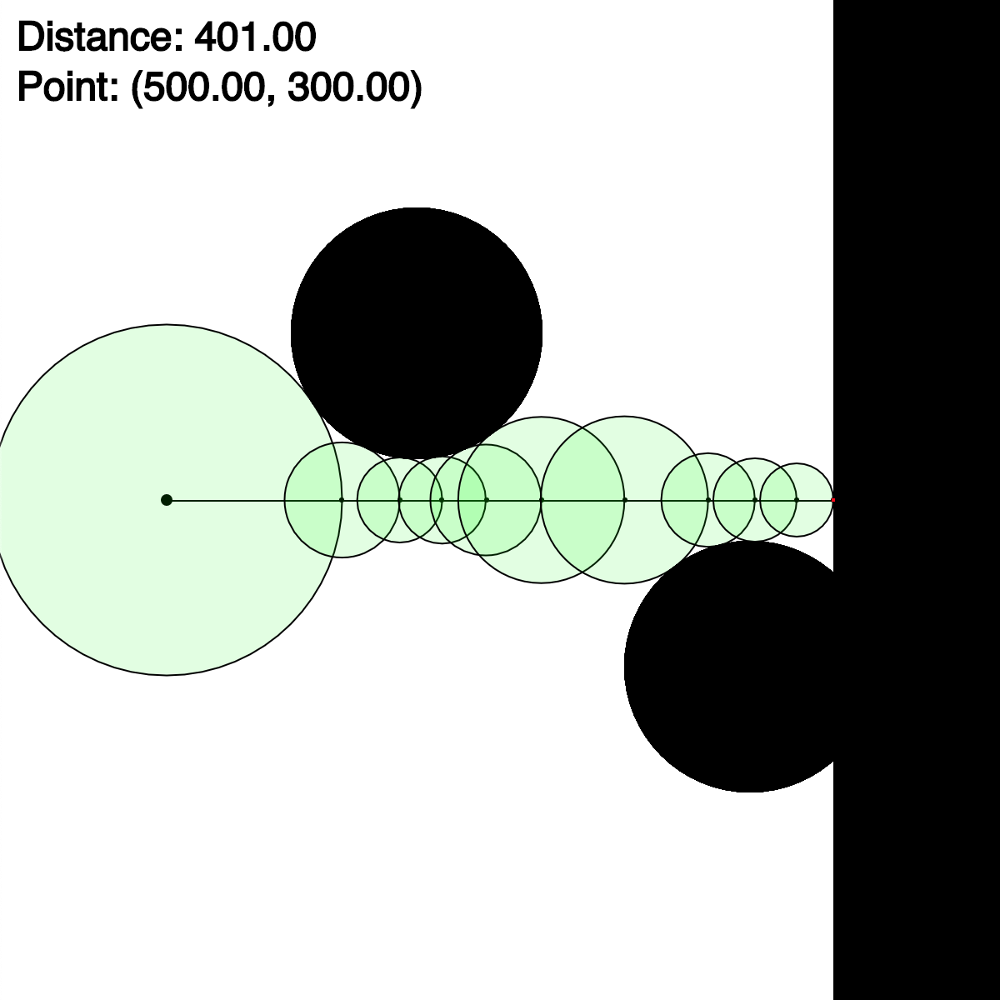
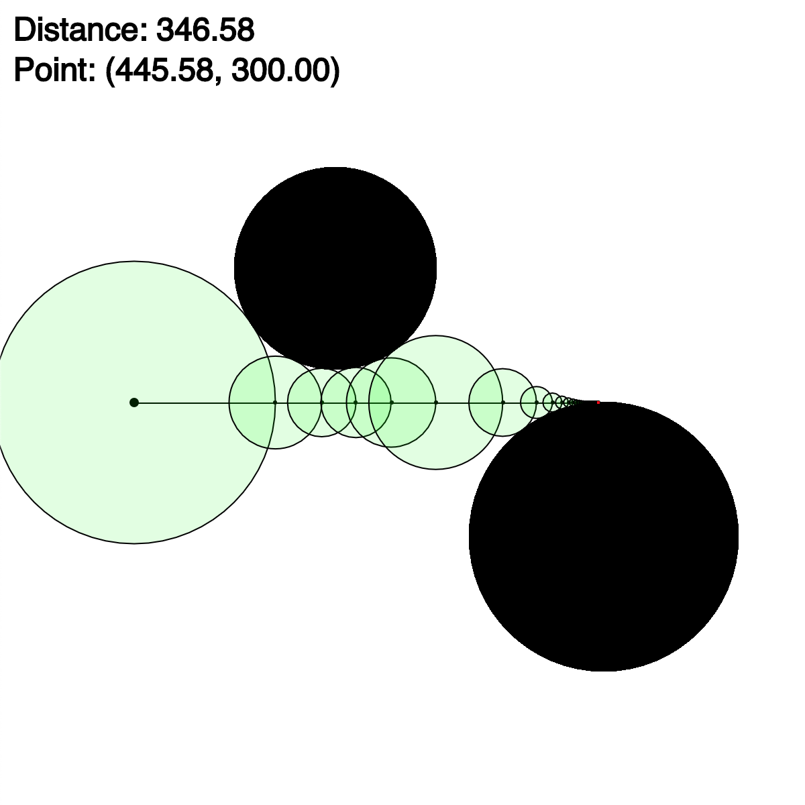
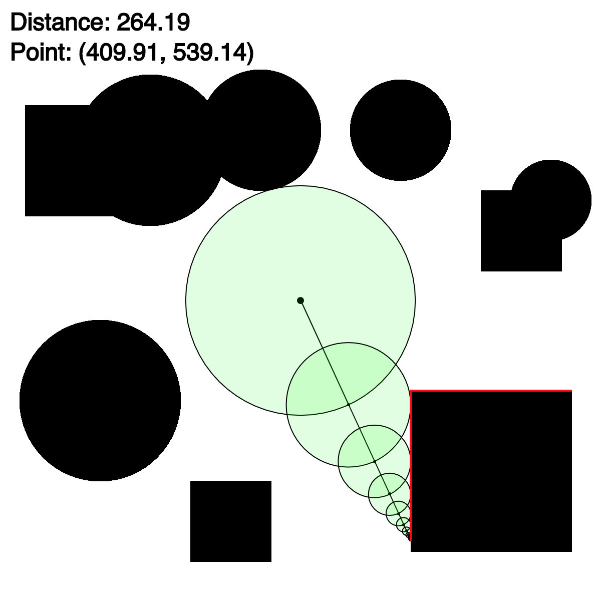
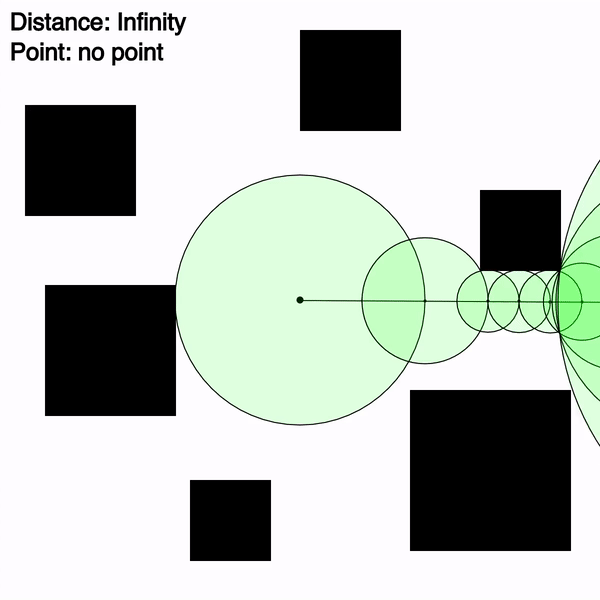
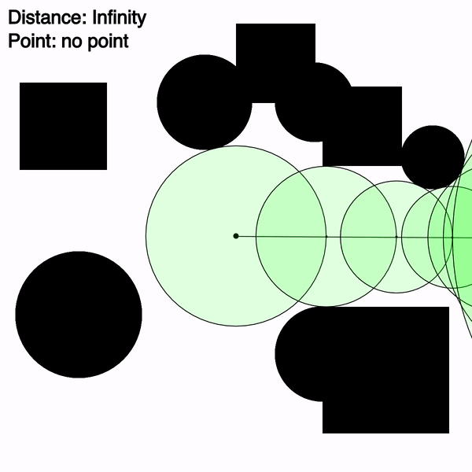

# Ray Marching

### Visualization of the ray marching algorithm with circle tracing

Made with JavaScript and visualized with the p5.js library

**Ray Marching:** A recersive algorithm which allows you to <ins>find the intersection between a ray and an object given a distance function can be determined.</ins> To determine the intersection for a given ray, the distance to the closest object is found and the ray advances that distance in the direction of the ray. The distance to the closest object is found again and the ray advances in the same way. This repeats recursively until the distance found approaches infinity or 0. If it approaches 0, the ray has intersected an object. If it approaches infinity, there are no objects in the direction of the ray.



---

**Circle**

A distance function for a circle is easy to determine which allows the calculation for their intersection with a ray with this algorithm.

```javascript
const point = { x, y };
const circle = { x, y, r };

const distance = (point, circle) => {
	return dist(point.x, point.y, circle.x, circle.y) - circle.r;
}
```


---

**Rectangle**

A distance function can also be found for a rectangle.

```javascript
const point = { x, y };
const rectangle = { x1, y1, x2, y2 }

const distance = (point, rectangle) => {
	const dx = Math.max(rectangle.x1 - point.x, 0, point.x - rectangle.x2);
	const dy = Math.max(rectangle.y1 - point.y, 0, point.y - rectangle.y2);
	return sqrt(dx * dx + dy * dy);
}

```



---

**Combination of Shapes**

Multiple shapes can be combined and this algorithm will still work.



---

Applications

-   Any shape can be added given a distance function can be determined
-   A sprite can have several rays

<br>
<br>
<br>

Sources: https://www.youtube.com/watch?v=Cp5WWtMoeKg
